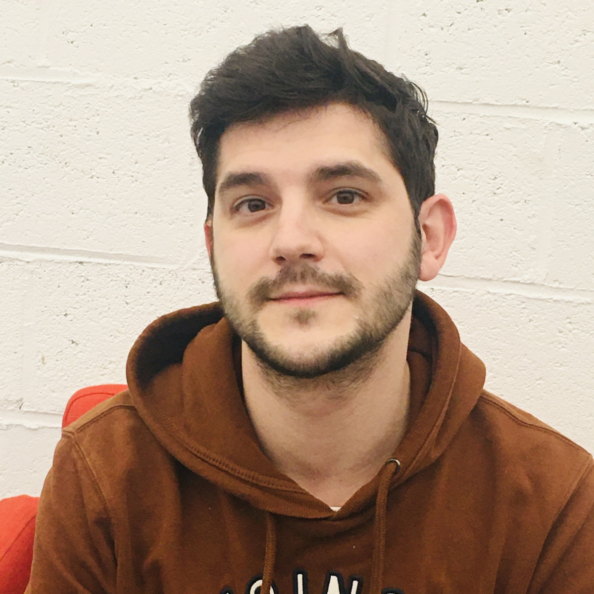

# challenge-markdown
solo with groupinteraction

# Matthias Urgu

_“Si la chèvre avait la queue plus longue, elle pourrait balayer les étoiles.”_

## I smile everything

| Matthias Urgu  |  |
| ------------- | ------------- |
| Birthday  | 02/09  |
| Gender  | Alpha  |
| Favorite color:  | Black |
| Favorite food: | Pizza |
| Pinneapple on pizza: | ☒ |
 

 ## Hobbies

 * Animation
    * 3d animation
    * Anime
 * 3d
    * Modeling
 * Sport
 * Cat
 * Voldemort

 ## You can always count on me when 
 * your're sad and angry 

 ## Tell your teammates which positive contribution to the group you will make.

 * Je suis concentré , timide mais aime aider les autres

## A funny story 

A la fin de mes études j'ai du aller au CPAS pour pvr continuer à payer mon logement , celui-ci est situé à Jambes près de Namur. Il se trouve que justeavant ce b^atiment se trouve un autre grand complexe que j'ai confondu. Je suis donc rentré dedans et me suis assis dans un long couloirs quelques minutes plus tard je me suis rendu compte au vus du nombre de vieilles personnes venant faire la discussion avec moi que j'ai atteri dans une maison de retraite. Malheureusement me rendant compte de mon erreur, les portes de sortie ne s'ouvrait qu'avec un code.... je suis donc resté 20 minutes de plus encerclés par des mort-vivant.
#### TL;DR

Ils sont légion!!

[<< previous](https://github.com/mara85kh/challenge-markdown) || [Matthias Urgu](https://github.com/becodeorg/CRL-Keller-4/blob/main/1.The-Field/03.MarkDown/2.challenge-markdown.md) || [next >>](https://github.com/Kurner/challenge-markdown)